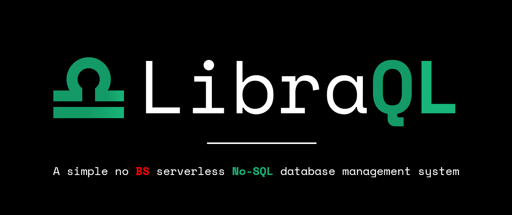

<div align="center">
  
</div>

# Disclaimer

- ⚠️ The project is under very active development.
- ⚠️ Expect bugs and breaking changes.

## Contents
- [About the Project](#about-the-project)
- [Database Storage](#database-storage)
- [Data Access](#data-access)
- [Manual](#manual)
  - [Git](#git)
  - [Coding text editor](#coding-text-editor)
  - [Setting up Python](#setting-up-python)
  - [Virtual Environment](#virtual-environment)

---
# About the Project

**LibraQL** is all about making the functionalities of interacting with a database easier like never before. It serves as a lightweight database management system, that is totally serverless, and is designed to make your life a whole lot easier, well when it comes to data management anyways.

## Database Storage:
### Bye Bye JSON...
There are many No-SQL **DBMS's** out there, in particular document **DBMS's** such as **MongoDB**, **CouchDB** and **RavenDB**. All of these DBMS's store data in a **_JSON-like_** format. Now if you're wondering what heck [JSON](https://en.wikipedia.org/wiki/JSON) is all about, it is simply a very popular data format that is primarly used by web applications. It is short for (_*JavaScript Object Notation*_).

The problem with **JSON** however, is that is not a particularly token efficent format, in laymans term's meaning there are many redundant characters such as **brackets** `[]`, **braces** `{}`, **quotes**: `""` and **commas** `,`. This inflated amount of tokens can get very hard to read for tools like **DBMS's** to process, particularly when reading through **large** datasets.

### Hello TOON...
However **LibraQL** utilizes a new revolutionary data format called **TOON** _(Token-Oriented Object Notation)_ for its database storage. 

### Visuals of why TOON is better
**JSON** vs **TOON** objects containing 2 users:
**JSON**: _12 lines of code_
```json
"users": [
    {
        "id": 1,
        "name": "Alice",
        "role": "admin"
    },
    {
        "id": 2,
        "name": "Bob",
        "role": "user"
    }
]
```
**TOON**: **_only 3 lines of code!!_**

```toon
users: id,name,role
1,Alice,admin
2,Bob,user   
```
As you can see, TOON takes up way less lines compared to an equivalent JSON object with equivalent data. Anyways, enough about my rant about TOON, here is some more stuff about TOON linked down below:


[More about TOON and it's usage for LLM's](https://medium.com/@jenilsojitra/the-complete-beginners-guide-to-toon-format-token-oriented-object-notation-957e8cf14590)

## Data Access

The query language for **LibraQL**, is heavily inspired by the query language used in the popular No-SQL DBMS, [MongoDB](https://www.mongodb.com/docs/manual/tutorial/query-documents/). Just like MongoDB's query language, LibraQL utilizies the creation of databases as objects, the creation of collections as well as using functions for **_creating, finding, modifying and deleting_** items in data collections.

### Basic data access functionalities in LibraQL vs SQL
| Function | LibraQL | SQL _(MariaDB_) |
|----------|---------|-----|
| Creating a database | `db = LibraQL("my_awesome_database.toon")` | `CREATE DATABASE my_awesome_database;`  |
| Creating a collection/table | `users = db.collection("users")` | `USE DATABASE my_awesome_database; CREATE TABLE users ( name VARCHAR(100) NOT NULL, age INT NOT NULL);`|
| Creating data | `users.insert({ "name": "Brent", "age": 21 })` | `INSERT INTO users VALUES ("Brent", 21); ` |
| Finding data | `users.find()` | `SELECT * FROM users;` |
| Updating data | `users.update({"name": "Brent"}, {"age": 34})` | `UPDATE users SET age = 34 WHERE name = 'Brent'; ` |
| Deleting data | `users.delete({"name" "Brent"})` | `DELETE FROM users WHERE name = "Brent";` |

## Manual

### Git
To get started with this project and or/contributing to it, you will use [**Git**](https://git-scm.com/)
and a terminal of your choosing. 

If you are a Mac user, or a Linux user you can just use the terminal that comes with your computer.

But for Windows users however, you can could use Command Prompt or PowerShell.


#### Verify installation
Once you have **Git** installed on your computer, you can run the following command below to verify the installation of Git.

```bash
git --version
```
> **Note:** When installed correctly, you will see the version number. `git version 2.45.0.windows.1`

### Cloning the project repo
To get started and run the following command in your terminal:

```bash
git clone https://github.com/batcsg1/LibraDB
```
Wherever you cloned the repo on your machine, you can change into the directory where the repo is. You can run the following command, if you cloned the repo within your current working directory.

```
cd LibraDB
```

### Coding text editor

For this project you will need some editor, preferablly an IDE such as [**VSCode**](https://code.visualstudio.com/) or a basic text editor such as [**Sublime Text**](https://www.sublimetext.com/).

Once VSCode or Sublime Text have been installed, you can open the repo in the editor. To open the repo in VSCode, you can run this one-line command in your terminal, to show off how much of a nerd you are:

```bash
code LibraDB
```
> **Note:** This particular command will work if the repo is within your current working directory hence the `LibraDB` without any `\` slashes.

You will now want to open up a new terminal window in your editor. In VSCode you can start by launching the terminal by selecting the `'Terminal'` option from the `☰` dropdown menu in the top left corner.

---

### Setting up Python

This project uses Python 3, so if you don't have it already, it's important to update to the latest version.

#### macOS
If you are a Mac user, your computer will most likely come with a pre-installed version of Python, but it will usually be a Python 2.x version. Here is an article by **GeeksForGeeks** below to help with Python installation on macOS:

[https://www.geeksforgeeks.org/python/how-to-install-python-on-mac/](https://www.geeksforgeeks.org/python/how-to-install-python-on-mac/)

#### Windows
For Windows users, you can just download Python 3.12 or 3.13 from the Microsoft Store. Or you could download Python from the offical website:

[https://www.python.org/downloads/windows/](https://www.python.org/downloads/windows/)

#### Linux
Whereas for Linux users, Python is simply pre-installed by default.

#### Verify installation
Run the following command in your terminal:
```py
python --version
```
> **Note:** If installed correctly you will see the version number: **`Python 3.11.9`**

Check if Python's package manager (**pip**) has been installed:

```py
pip --version
```
> **Note:** If installed, the version of **pip** will display **`pip 25.1.1`**

---

### Virtual Environment
A **virtual Python environment** will be setup to isolate this project's dependencies from other **Python** projects you may have on your machine. This is to mitigate potential dependency conflicts between different Python projects.

#### Creating a Virtual Environment
To setup the **virtual environment**, you can use the built-in Python module `venv`. 

Run the following command in your terminal:

```py
python -m venv .venv
```
This will create a new directory called `.venv` in the root directory of this project.

#### Activating the Virtual Environment
On Windows, run the following command:
```pwsh
.venv\Scripts\activate
```
On macOS or Linux, run this command:
```bash
source .venv/bin/activate
```
Once the virtual environment is activated, you should see the name of it in your terminal prompt.

#### Install dependencies
To install the dependencies for this projects, run the following command: 
```bash
pip install -r requirements.txt
```
This will install the dependencies as specified in the `requirements.txt` file on the root of this repo.


---
<div align="center">
  

  **Copyleft 🄯 2026 Samuel Batchelor**
  
  [](https://github.com/batcsg1/LibraQL/blob/main/LICENSE)

  *Freely distributable and modifiable under the [GNU AGPL v3.0](https://github.com/batcsg1/LibraQL/blob/main/LICENSE).*
</div>
